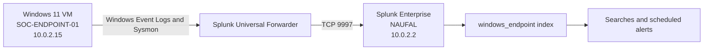

# Lab Architecture

## Network and log flow

## Components

| System | Role | Main services |
|---|---|---|
| `SOC-ENDPOINT-01` | Monitored Windows endpoint | Sysmon and Splunk Universal Forwarder |
| `NAUFAL` | Splunk server and analyst workstation | Splunk Enterprise and Splunk Web |

## Ports

| Port | Direction | Purpose |
|---:|---|---|
| `9997/TCP` | Endpoint to Splunk server | Receives forwarded events |
| `8000/TCP` | Analyst browser to Splunk server | Splunk Web interface |
| `8089/TCP` | Local Splunk management | Splunk management service |

## Data flow validation

Use these checks when troubleshooting the pipeline:

1. Confirm the `SplunkForwarder` service is running on the endpoint.
2. Confirm `10.0.2.2:9997` appears under active forward destinations.
3. Confirm the Splunk server is listening on TCP port `9997`.
4. Search `index=windows_endpoint host="SOC-ENDPOINT-01"` in Splunk.
5. Compare the latest event time with the current endpoint time.

Replace this Mermaid diagram with a polished exported diagram later if needed.
